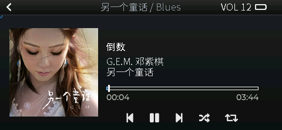
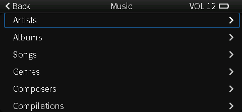
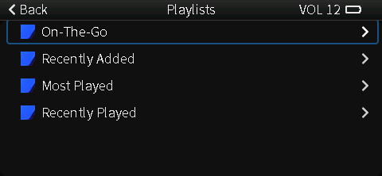
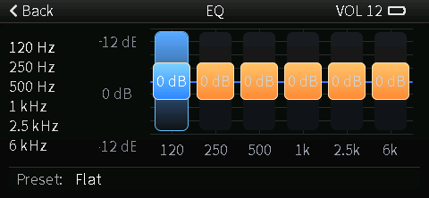
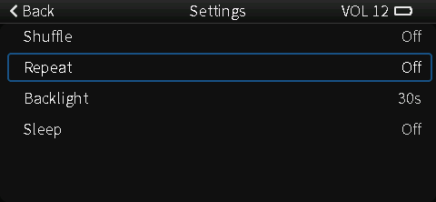

## 🎵 LoFiBox

[English](README.md) | **简体中文**

**LoFiBox** 是一款轻量、离线的音乐播放器，面向 **ESP32 级别嵌入式设备**。

它专注把几件事做好：

* 本地 **MP3 / WAV** 播放（SD 卡）
* **多段 EQ** 实时调节
* 复古设备风格的 **按键式 UI**
* 可预测的 CPU / 内存占用，适合长期运行

LoFiBox 不做流媒体，也不追求 Hi‑Fi。
它是一个完全离线、无需账号、无需网络的设备端播放器。

---

### 🧩 功能亮点（含截图）

#### ▶️ Now Playing（正在播放）

- 曲目信息与进度一目了然：标题、时间、进度条
- 播放状态与模式提示：顺序 / 随机 / 单曲循环
- 让“正在听什么”成为主屏体验

#### 🎵 Library（音乐库）

- SD 卡本地曲库浏览，列表结构清晰
- 快速定位与切换曲目
- 适配实体按键 / 旋钮的层级导航

#### 📂 Playlists（播放列表）

- 播放列表入口，强调“组织”而非复杂操作
- 适合离线设备的固定播放场景

#### 🎚️ EQ（均衡器）

- 多段 EQ 实时调节，强调“听感变化”
- 轻量 UI，快速调参而非复杂图形

#### ⚙️ Settings（设置）

- 亮度、睡眠、行为偏好等常用设置集中入口
- 低层级、少步骤，适合小屏与物理键交互

---

### ✨ 设计目标

* **离线优先**
  不依赖蓝牙、Wi‑Fi 或云服务。

* **嵌入式友好**
  面向 ESP32 级 MCU 的 RAM / Flash / 带宽约束。

* **可用而非花哨**
  UI 强调清晰和触感交互，避免无意义动画。

* **EQ 为核心功能**
  多段均衡器是主要体验，不是附属工具。

---

### 🎛 界面理念

界面灵感来自 **经典 iPod**：

* 列表式导航
* 清晰层级：Library → Track → Now Playing → EQ
* 最小化屏幕刷新
* 物理按键优先而非触摸手势

目标是让播放体验保持 **稳定与克制**，在小屏上也可轻松操作。

---

### 🔧 技术概览

* 目标平台：**ESP32 / ESP32‑S3**
* 音频格式：**MP3, WAV**
* 音频链路：
  SD → Decoder → PCM → Multi‑band EQ → Output
* UI 框架：**LVGL**
* 输出：I2S DAC 或设备自带音频路径（依硬件而定）

---

### ⌨️ 按键操作

#### 播放控制
- **A** - 播放/暂停
- **N** - 下一首
- **P** - 上一首
- **V** - 循环音量档位（共 1 级，范围 0-21）

#### 播放模式
- **M** - 切换播放模式
  - SEQ：顺序播放
  - RND：随机播放
  - ONE：单曲循环

#### 屏幕控制
- **L** - 亮度档位切换（5 档）
- **S** - 屏幕开/关（关闭时保存亮度，打开时恢复）

#### 文件管理
- **D** - 弹出删除确认
  - **Y** - 确认删除当前曲目
  - **C** - 取消删除

#### 截屏
- **F** - 截屏并保存到 SD
  - 截图存放在 `/screen` 目录
  - 文件名格式：`screenshot_YYYYMMDD_HHMMSS.bmp`
  - 若目录不存在会自动创建

---

### 📌 LoFiBox 是什么 / 不是

**LoFiBox 是：**

* 自包含的嵌入式音乐播放器
* 适合 DIY 设备、掌机、PDA、实验硬件
* 可作为更大系统中的音频子模块

**LoFiBox 不是：**

* 手机音乐 App
* 流媒体 / 云音乐播放器
* Hi‑Fi 参考设计
